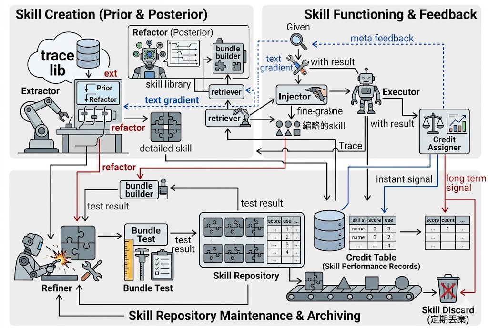

# You Live More than Once: A Software Engineering's Perspective for Test-time Skill System Evolution

## 1. 核心 Story

我们的出发点是一个部署后的 agentic system：模型参数固定，用户需求不断到来，任务类型逐渐变多，系统必须在不重新训练模型的情况下积累经验。

已有工作已经证明，LLM 可以从轨迹中提取 skill，也可以编辑、反思、优化 skill。但这还不是长期部署系统最核心的问题。真正困难的是：**当系统持续产生大量候选 skill 时，哪些 skill 应该留下，哪些应该被修改、合并、降权或删除？**

换句话说，我们关注的不是“能不能生成一个 skill”，而是“能不能维护一个长期有用的 skill 仓库”。

因此，本文的核心观点是：

> Test-time Skill Evolution 应该被建模为一个软件工程问题：skill 是外部、可版本化、可测试、可维护、可复用的软件制品；skill evolution 是围绕正确性、复用性和可维护性的在线仓库治理过程。

这也是我们主打“软工复用性”的原因。一个 skill 的价值不在于它是否能复现产生它的历史任务，而在于它是否能在未来未知但相关的任务中被稳定复用。历史 trace 只是证据，未来复用才是目标。

## 2. 为什么主打“复用性”

如果只看单个任务，skill evolution 很容易退化成一种局部修补：模型错了，就让 LLM 写一条提示、一个函数或一个规则。这种 skill 可能在源任务上有效，但长期运行时会遇到三个问题。

第一，单条 trace 的证据太窄。一个 skill 如果只是记住某个历史答案、某个局部路径或某个偶然错误，它会在未来任务中产生 prompt pollution。

第二，skill 仓库会快速膨胀。不断 append 新 skill 看似覆盖更多情况，但会带来检索噪声、上下文成本、冗余规则和相互冲突。

第三，skill 会随环境变化而过时。工具 schema、任务分布、用户意图和已有 skill 之间的依赖关系都会变化。如果没有版本控制、测试和维护流程，仓库会变成不可治理的 memory dump。

因此，我们把 skill 的核心属性定义为三类：

- **正确性**：skill 必须忠实实现某个局部能力，不能破坏任务合约。
- **复用性**：skill 必须捕捉跨任务稳定存在的局部不变量，而不是历史样本的表面细节。
- **可维护性**：skill 必须能被测试、修改、合并、禁用、回滚，并能与其他 skill 共同组成一个低噪声仓库。

这三者中，正确性是底线，可维护性是长期运行的保障，而复用性是 skill 真正区别于普通 trace memory 的核心价值。

## 3. 方法总览：一个闭环 Skill 仓库



我们的方法可以理解为一个在线闭环系统。每个训练任务到来时，系统先使用当前 active skill 仓库执行任务；任务完成后，系统从结果中抽取新证据，判断旧 skill 的贡献，并决定是否修改仓库。训练结束后，用冻结的 skill 仓库做 held-out evaluation。

整个闭环包含五条逻辑链路：

1. **执行链路**：用当前 active skills 辅助模型完成任务。
2. **提取链路**：从新 trace 中提出 candidate skills，但先作为 pending，不立刻污染执行。
3. **归因链路**：判断已检索或已注入 skill 在当前任务中是帮助、伤害、无关还是不确定。
4. **维护链路**：把归因信号转化为局部测试、refinement、禁用或证据记录。
5. **慢反馈链路**：在一个时间窗口内总结仓库层面的规律，更新 extractor 的偏好和仓库治理策略。

这五条链路形成一个从任务执行到仓库治理的闭环：skill 不是一次生成后永久有效，而是在真实使用、测试和反馈中持续接受证据审查。

## 4. 流程划分：Execution、Micro、Macro

为了避免把所有维护动作混成一个“万能后处理”，我们按时间尺度把系统划分为三层。

### 4.1 Execution：使用当前稳定能力

执行层只使用 active skills。pending skill 仍然只是候选证据，不会被注入模型上下文。

这一层的目标是完成当前任务，同时留下可审计的执行证据：模型做了什么、检索了哪些 skill、是否使用了 skill、哪里出错、token 成本是多少、官方 verifier 如何评价。

这一设计对应软件工程中的生产环境原则：只有通过一定证据门槛的模块才能进入线上路径，候选模块不能直接影响用户请求。

### 4.2 Micro Maintenance：单任务局部维护

micro 层处理当前任务给出的局部反馈。它回答的问题是：

> 当前任务是否说明某个相关 skill 需要被修补、补测试、降权或记录证据？

它不做全局重构，也不扫描整个仓库。它只处理当前任务中有证据相关的 skill。

这里的关键思想是 credit-guided maintenance。任务失败并不自动说明某个 skill 有害；skill 被检索到也不自动说明它有用。我们需要先判断 skill 对这条 trace 的具体贡献，再决定是否维护。

### 4.3 Macro Maintenance：窗口级仓库治理

macro 层处理一段时间内积累的证据。它回答的问题是：

> 经过一个任务窗口后，仓库结构是否应该变化？

它关注的是 repository-level selection：哪些 pending skill 应该被提升，哪些 skill 重复，哪些 skill 长期产生噪声，哪些 trace 片段显示出共同的可复用结构。

macro 层承担的是软件工程中的架构维护职责：重构、去重、过滤、版本关系和长期反馈，而不是单个 bug 的局部修补。

## 5. Skill 属性划分：不同任务需要不同形态的 Skill

我们不把 skill 限定为一段代码。代码函数只是 skill 的一种形态。真实 agentic tasks 中，可复用能力可能以不同形式存在。

### 5.1 Workflow Skill

Workflow skill 描述多步任务中的顺序、状态传递和决策边界。

例如在 BFCL 中，用户先创建对象、后续轮次引用该对象时，skill 的关键不是某个具体 API，而是“后续操作必须复用前一轮工具返回的 canonical id”。这类 skill 适合表达为工作流规则。

### 5.2 Executable / API Idiom Skill

Executable skill 更接近可执行模式或代码 idiom。

在 SpreadsheetBench 中，skill 往往是 openpyxl 操作模式、公式写入模式、sheet/range 处理习惯，或者“保留 workbook 其他内容”的 artifact manipulation idiom。这类 skill 不只是文本知识，而是可复用的程序性动作。

### 5.3 Knowledge / Reference Skill

Knowledge skill 提供领域约束、格式规范或局部事实，但必须有清晰作用域。它不能变成宽泛常识，否则会造成检索噪声。

这种多形态设计是我们强调复用性的直接结果：不同任务的可复用结构不同，skill format 必须匹配任务结构，而不是强行把所有经验都压成同一种函数。

## 6. 信号反馈链路

### 6.1 Trace 到 Candidate Skill：前向压缩

执行 trace 是经验来源，但 trace 本身太长、太具体，不能直接作为 skill。extractor 的任务是把 trace 压缩成可复用的局部不变量。

这个过程必须保守：如果证据只能支持一个源任务，就不能提取成宽泛规则；如果证据显示的是失败，则只能提取明确的修复模式或负面 guardrail，而不是凭空生成能力。

新 skill 首先进入 pending 状态。pending 的意义是：我们保留这个假设，让它参与后续比较和重构，但暂时不让它影响 executor。

### 6.2 Trace 到 Credit：后向归因

credit assignment 是系统的核心反馈机制。它判断每个相关 skill 对当前 trace 的作用：

- helpful：可能提升了正确性、减少错误或对齐了工作流；
- harmful：可能造成错误路径、错误 schema、错误公式、无关领域迁移或 prompt pollution；
- neutral：出现了但没有实质影响；
- uncertain：证据不足。

这个判断让系统避免两个常见错误：把所有被检索到的 skill 都当作有用，或者把所有失败都归咎于 skill。

### 6.3 Credit 到 Bundle：把反馈变成可测试资产

只有当 credit 指出明确、可重放的局部证据时，系统才把它转成 bundle case。bundle case 的作用不是保存整条历史任务，而是保存和某个 skill 相关的最小测试片段。

这一步相当于软件工程中的 regression test：当我们发现某个 skill 帮助或伤害了某类行为，就把这个行为转成未来维护时可以反复验证的测试资产。

### 6.4 Bundle 到 Refinement：先定位，再修补

refiner 不应该看到整个仓库后自由发挥，而应该围绕目标 skill、失败测试、credit 证据和依赖上下文做局部修改。

如果归因已经明确指出某个 skill 的 scope 太宽、schema 错误或 workflow 错误，系统会先进行局部修补，再用 bundle tests 验证。这样避免把明显错误的旧版本反复拿去做昂贵 replay，也避免因为无关任务失败而重写 broad skill。

### 6.5 Window 到 Refactor：跨任务复用结构发现

单个任务只能提供局部证据。要发现真正的复用结构，需要把一个窗口内的 trace segments、pending skills 和 active skills 放在同一个证据空间中比较。

macro refactor 的角色不是“再生成一些 skill”，而是判断哪些候选代表了跨任务共享结构，哪些只是重复、噪声或过拟合。只有通过窗口级证据和测试门槛的候选才会进入 active 仓库。

### 6.6 TRL / Textual Rule Learning：慢反馈到 Extractor

除了修改具体 skill，系统还需要学习“以后应该怎样提取 skill”。这就是 TRL 链路在本文中的位置。

这里的 TRL 不是更新基础模型参数，而是把运行时反馈转化为 extractor 的文本规则或 meta-skill。它是一条慢反馈链路：

```text
usage / credit / bundle / refactor evidence
        -> repository-level feedback summary
        -> extractor rules or meta-skills
        -> future extraction becomes more conservative or more targeted
```

例如，如果一段时间内系统发现许多 skill 因为 scope 过宽而 harmful，TRL 应该反馈给 extractor：未来提取时必须写清 non-applicability，避免跨 domain 泛化。如果许多 skill 因为 schema mismatch 被 refine，TRL 应该让 extractor 更重视工具接口和参数名。如果某些 candidate 长期低复用，TRL 应该让 extractor 提高“可复用证据”的门槛。

这条链路的作用是把局部维护经验上升为提取策略的改变。它对应软件工程中的 coding guideline / review rule 更新：不是只修一个 bug，而是总结为什么这类 bug 反复出现，并改变未来生成代码的规范。

因此，我们的闭环不只是：

```text
trace -> skill -> test -> refine
```

而是更完整的：

```text
trace -> skill candidate -> usage evidence -> credit -> tests/refine/filter
      -> repository feedback -> extractor rule update -> better future skills
```

## 7. 为什么这是一种软件工程方法

从软件工程角度看，我们的方法有四个核心设计原则。

第一，**模块化**。每个 skill 都有明确作用域、接口和证据，不应该混合多个无关职责。

第二，**测试优先**。skill 的价值必须通过可重放的任务片段、集成表现和 held-out 结果来验证，而不是只看 LLM 自我解释。

第三，**版本化维护**。skill 会变化，因此需要状态、历史、依赖、禁用、归档和回滚机制。

第四，**仓库治理**。长期性能来自整个 skill population 的质量，而不是单个 skill 的局部最优。系统必须控制冗余、冲突、噪声和维护成本。

这也是我们和普通 prompt memory / trajectory distillation 的区别：我们关心的是可长期运行的 skill system，而不是一次性的经验摘要。

## 8. Benchmark 叙事

BFCL 和 SpreadsheetBench 覆盖了两类互补的 agentic failure。

BFCL 测试结构化工具调用：多轮状态、工具 schema、参数名、调用顺序和 official expected calls。它适合验证 workflow skill 和 interface contract skill 是否能减少工具调用错误。

SpreadsheetBench 测试真实文件操作：workbook artifact、openpyxl code、sheet/range、公式和值、格式保留以及 golden workbook verifier。它适合验证 executable API idiom 和 artifact manipulation workflow 是否能跨任务复用。

这两个 benchmark 共同说明：我们的框架是 benchmark-agnostic 的，但每个 benchmark 必须有自己的 trace projection、verifier 和可重放测试片段。抽象算法相同，证据接口必须本地化。

## 9. 最新结果

### 9.1 BFCL v3 Related 50/50

| Setting | Exact success | Official valid | Avg score | Avg tokens / task | Timeout |
|---|---:|---:|---:|---:|---:|
| Baseline, no skills | 0.06 | 0.44 | 0.7312 | 70,323.8 | 0.00 |
| Evolve, frozen skill-store rerun | 0.08 | 0.74 | 0.7991 | 86,813.3 | 0.00 |

BFCL 的主要结论是 correctness improvement：official valid 从 0.44 到 0.74，avg score 从 0.7312 到 0.7991。exact success 只小幅提升，说明当前 skill 主要修复 workflow 和 contract 层面的错误，尚未完全解决严格终态匹配问题。

token 成本上升约 23.5%。这说明当前 prompt-only skill 注入仍然偏重，尚未充分替代推理步骤。因此 BFCL pilot 目前不应被讲成 token efficiency 结果，而应讲成 skill repository 对 structured tool correctness 的改善。

### 9.2 SpreadsheetBench-Verified 50/50

| Setting | Exact success | Official valid | Avg score | Avg tokens / task | Timeout |
|---|---:|---:|---:|---:|---:|
| Baseline, test 50 | 0.22 | N/A | 0.2564 | 1,552.1 | 0.00 |
| Evolve, true maintenance 50/50 | 0.24 | N/A | 0.3208 | 3,748.2 | N/A |

Spreadsheet 的主要结论是 benchmark transfer：同一套 skill evolution 思想可以迁移到 artifact manipulation 场景，并且真实维护链路已经跑通。avg score 从 0.2564 到 0.3208，success 从 0.22 到 0.24。

这次运行生成 53 个 skills，其中 35 个 active、17 个 disabled、1 个 archived。系统记录了 200 条 credit events、50 个 micro reports、5 个 macro windows，并且 held-out 阶段所有任务都检索到了 skill。

同时，这个结果也暴露了当前瓶颈：token 成本从 1,552.1 上升到 3,748.2，说明 Spreadsheet skill 上下文仍然过重，检索噪声和 skill compression 仍需优化。大量 harmful credit 和 disabled skills 也说明 extractor 会产生过宽或不稳定的候选，后续需要更强的 TRL 反馈、retrieval guard 和 repository selection。

