# Skill Repository Maintenance Architecture

本文档解释当前后端实现，而不是只索引源码。目标读者是后续维护者、论文作者和审稿前自查人员：读完后应能清楚知道一次 evolve 实验中每个对象如何产生、如何流转、如何测试、如何版本化、如何回退，以及哪些实现仍是第一版近似。

文档中的图使用 Mermaid。建议在 `/maintenance-docs` 或支持 Mermaid 的 Markdown viewer 中阅读。

---

## 1. 一句话架构

当前系统把 skill repository 当成一个“可测试的软件库”来维护：

- `SkillArtifact` 是版本化资产，不只是文本卡片。
- `SkillBundle` 是长期维护的 unit-test-like 测试资产。
- `SkillTestResult` 是每次测试产生的运行产物，和 bundle 分离。
- `ArtifactStore` 负责版本历史、依赖、stale、rollback、检索和审计。
- LLM roles 负责语义工作：extractor、bundle builder、refiner、stale resolver。
- BFCL adapter 把通用协议落到真实 function-calling benchmark 上。
- Web player 只消费结果和 debug events，不参与算法决策。

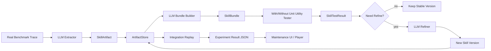

---

## 2. 后端分层

### 2.1 Layer Map

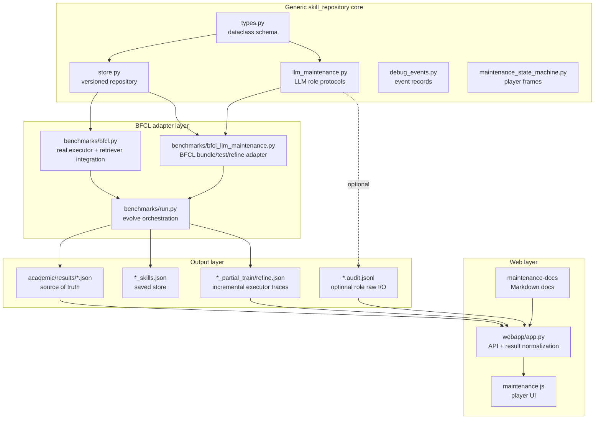

### 2.2 代码边界

通用层不应该知道 BFCL 的 tool schema、turn 格式、official checker 或 GorillaFileSystem 规则。任何 benchmark-native 逻辑都应在 adapter 层。

| Layer | 文件 | 后端职责 |
| --- | --- | --- |
| schema | `academic/skill_repository/types.py` | 定义 skill、interface、bundle、test result、lineage、dependency pin。 |
| store | `academic/skill_repository/store.py` | 版本化资产存取、检索、bundle/test result 分离、stale 传播、rollback。 |
| LLM roles | `academic/skill_repository/llm_maintenance.py` | 通用 extractor/bundle builder/refiner/stale resolver prompt、JSON parsing、audit log。 |
| BFCL execution | `academic/benchmarks/bfcl.py` | 真实 BFCL task executor、turn-level retrieval、tool call replay、official metrics。 |
| BFCL maintenance adapter | `academic/benchmarks/bfcl_llm_maintenance.py` | 把 BFCL result 转成通用 role 输入，把 bundle case 转回 BFCL task，并运行 with/without tests。 |
| orchestration | `academic/benchmarks/run.py::_run_bfcl_evolve` | 一次 evolve 实验的主流程，负责 train、extract、bundle、unit test、refine、replay、保存。 |
| UI API | `academic/webapp/app.py` | 扫描实验、加载 result、生成 pages/player frames。 |

---

## 3. 核心数据模型

### 3.1 Object Relationship

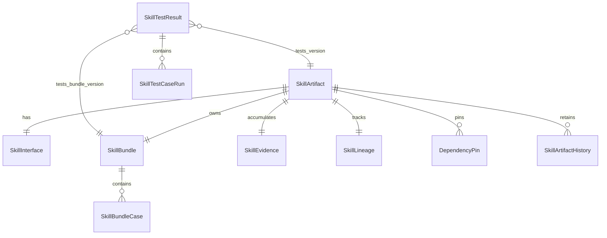

### 3.2 SkillArtifact

源码：`academic/skill_repository/types.py::SkillArtifact`

`SkillArtifact` 是 repository 中的基本资产。它有稳定 `name`，同名更新由 `ArtifactStore.add(...)` 发布为新版本。

关键字段：

| 字段 | 含义 | 当前使用处 |
| --- | --- | --- |
| `name` | repository key，跨版本保持不变。 | 检索、版本历史、依赖引用。 |
| `kind` | skill 类型，例如 `atomic_tool_rule_card`、`workflow_guardrail_card`。 | prompt、UI、injection type 推断。 |
| `description` | 短摘要。 | 检索文本、prompt block、UI card。 |
| `body` | 可执行语义内容。 | 注入 executor prompt。 |
| `metadata` | benchmark hints、source、allowed_tools、intent_keywords 等。 | BFCL retriever predicate/rerank、report。 |
| `version` | store 管理的单调版本。 | result/test lineage。 |
| `interface` | 结构化契约。 | bundle builder、refiner、stale resolver。 |
| `bundle` | 长期测试资产。 | unit utility tests。 |
| `evidence` | traces/helpful/harmful/integration evidence。 | refiner/refactor。 |
| `lineage` | parent、version_kind、migration reason。 | 版本解释、rollback。 |
| `dependency_pins` | 对上游 skill 的版本决策。 | stale/lazy migration。 |
| `dependencies` | 依赖的上游 skill 名。 | stale propagation。 |
| `history` | 旧版本快照。 | rollback。 |
| `stale/status` | lazy update 状态。 | retrieval/refine/stale resolver。 |

辅助方法：

- `retrieval_text()`：拼接 name/kind/description/body/interface/metadata，用于 cosine 检索。
- `prompt_block()`：生成注入 executor 的 prompt 文本。
- `version_kind()`：从 metadata 或 lineage 读取 seed/minor/major/rollback/refactor。
- `dependency_version_map()`：把 pins 转成 test result 可记录的版本快照。

### 3.3 SkillBundle 与 SkillTestResult 分离

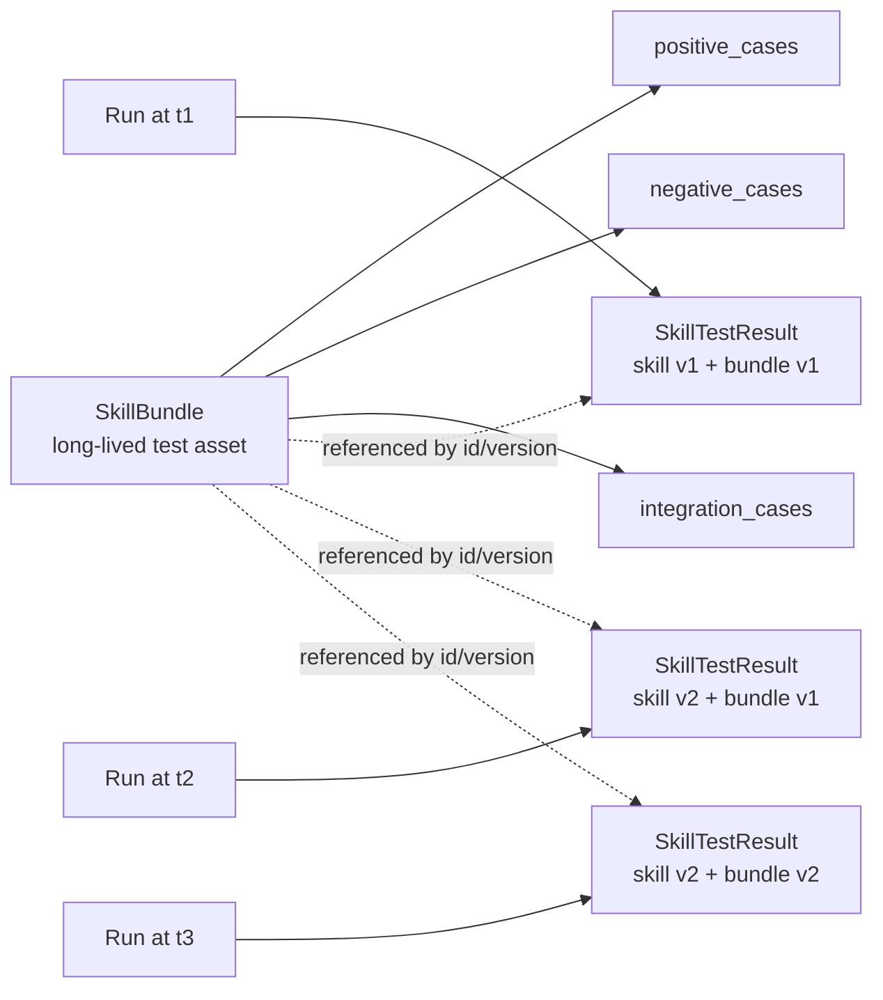

`SkillBundle` 是长期维护对象；`SkillTestResult` 是每次运行的事实记录。这样可以回答：

- 同一个 skill version 在不同 bundle version 下表现如何？
- 同一个 bundle version 在 refine 前后表现如何？
- 某次 regression 是 skill 改坏了，还是 test asset 迁移导致？

当前实现允许 skill version 和 bundle version 不强绑定。`ArtifactStore.add(...)` 中如果 skill 内容变了但 bundle 没变，skill version 递增而 bundle version 可保持不变；如果 bundle cases 变了，bundle version 递增。

### 3.4 Test Case Run 记录真实输入输出

源码：`SkillTestCaseRun` 和 `bfcl_llm_maintenance.py::_case_run_payload`

每个 case 会保存：

- `input_payload`：给 executor 的 task fragment、variant、top_k、skill injection mode。
- `expected_behavior`：bundle case expected、task expected、contrast protocol。
- `actual_output`：BenchmarkResult、metrics、trace summary。
- `tool_calls`：flattened tool calls。
- `trace`：完整 executor trace。
- `skill_snapshot`：with_skill 时的 skill 内容。
- `bundle_case_snapshot`：当时使用的 bundle case。

这也是前端 test report 能展示“给定条件 vs 模型输出”的数据来源。

---

## 4. ArtifactStore：版本、检索、依赖

### 4.1 Store Add/Update Flow

源码：`academic/skill_repository/store.py::ArtifactStore.add`

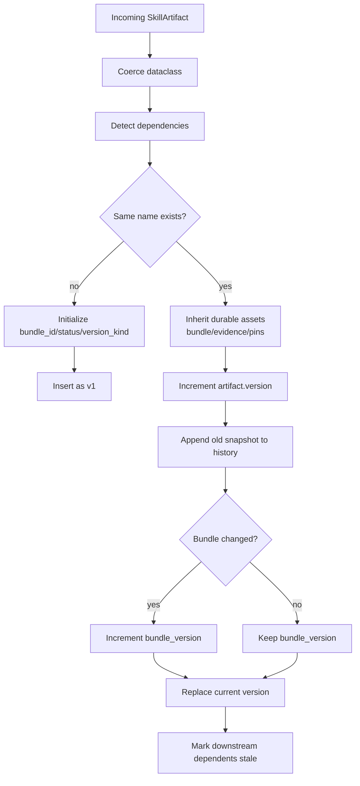

关键实现细节：

1. `ArtifactStore.add()` 不盲目覆盖同名 skill。
2. `_inherit_long_lived_assets()` 防止 extractor 只返回语义卡片时把已有 bundle/evidence/pins 清空。
3. 旧版本会以 `_artifact_snapshot(existing)` 形式进入 `history`。
4. 如果新 bundle 与旧 bundle 不同，bundle version 才递增。
5. 更新完成后调用 `_mark_dependents_stale(...)`。

### 4.2 Retrieval Flow

源码：`ArtifactStore.retrieve_audit`

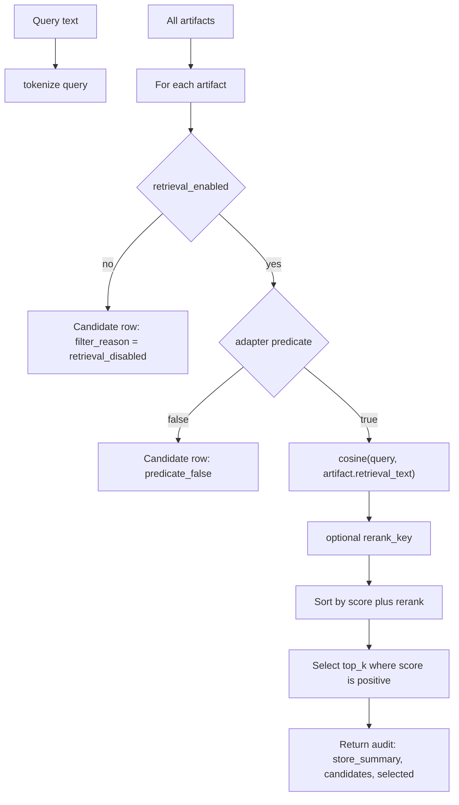

当前检索不是“必须包含 intent_keyword 才命中”。`intent_keywords` 只是 metadata，可被 adapter 的 predicate/rerank 使用。基础检索是 token cosine，输入来自 `artifact.retrieval_text()`。

审计 payload 保留：

- store summary：总数、active、stale、disabled。
- candidate rows：score、rank、predicate_passed、filter_reason、metadata。
- selected rows：name、rank、score、rerank。

### 4.3 Dependency/Stale Flow

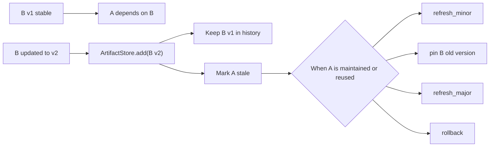

`_mark_dependents_stale()` 会沿 dependency graph 传播。下游不会被强制立刻迁移。后续 `refine_bfcl_skill_store_llm()` 遇到 `artifact.stale=True` 时会调用 stale resolver。

---

## 5. LLM Role Layer

源码：`academic/skill_repository/llm_maintenance.py`

### 5.1 Shared LLM Call Path

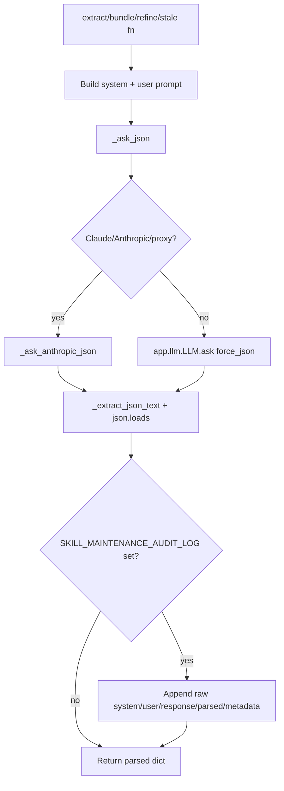

重要实现点：

- `_ask_json()` 会打印 `maintenance_llm_start/done` 到 stdout，包含 role、model、prompt chars、duration、response chars。
- Claude proxy 使用 Anthropic Messages API，`base_url` 可以是 `http://127.0.0.1:4000/v1`。
- `_extract_json_text()` 容忍模型返回 fenced ```json。
- `MAINTENANCE_JSON_MAX_TOKENS` 默认 4096。
- 如果设置 `SKILL_MAINTENANCE_AUDIT_LOG`，会把 raw role I/O 写入 JSONL；这次 `local_claude_10_fast` 没设置，所以没有 role audit rows。

### 5.2 Extractor

源码：

- `llm_maintenance.py::extract_skill_artifacts_from_results_llm`
- `bfcl_llm_maintenance.py::extract_bfcl_skill_artifacts_llm`

输入构造：

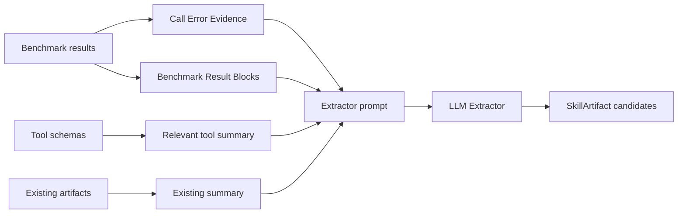

BFCL wrapper 做了三件事：

1. 从 traces 和 call_errors 中推断 `relevant_tools`。
2. 只传 relevant tool schemas 给通用 extractor，降低 prompt size。
3. 对 LLM 输出补充 BFCL metadata：`benchmark`、`source`、`allowed_tools`、`domains`、`intent_keywords`、`source_task_ids`。

注意：这一步是 LLM-driven，不是 benchmark rubric。但是 adapter 会做 schema filtering 和 metadata enrichment，这属于 benchmark glue，不是 skill 语义生成。

### 5.3 Bundle Builder

源码：

- `llm_maintenance.py::distill_skill_bundle_llm`
- `bfcl_llm_maintenance.py::build_bfcl_skill_bundles_llm`

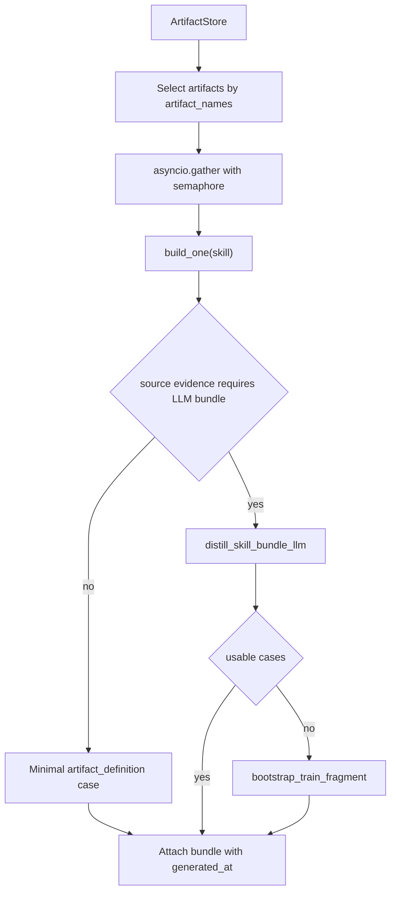

最近为速度和稳定性加入的实现：

- `BFCL_MAINTENANCE_CONCURRENCY` 控制并发，默认 2。
- LLM bundle prompt 要求最多 1 positive、1 negative、1 integration case。
- `distill_skill_bundle_llm()` 结果也会硬截断为每类最多 1 case。
- 若 LLM parse/timeout，打印 `bundle_builder_fallback`，保留旧 bundle 或生成 minimal fallback。

当前第一版约束：

- unit tester 目前只运行 `cases[:1]`，即每个 skill 最多跑一个 bundle case，以控制真实模型成本。
- 这会牺牲 bundle 覆盖率，适合 smoke/fast run，不适合最终论文大实验。

### 5.4 Refiner

源码：

- `llm_maintenance.py::refine_skill_artifact_llm`
- `llm_maintenance.py::apply_refine_payload`
- `bfcl_llm_maintenance.py::refine_bfcl_skill_store_llm`

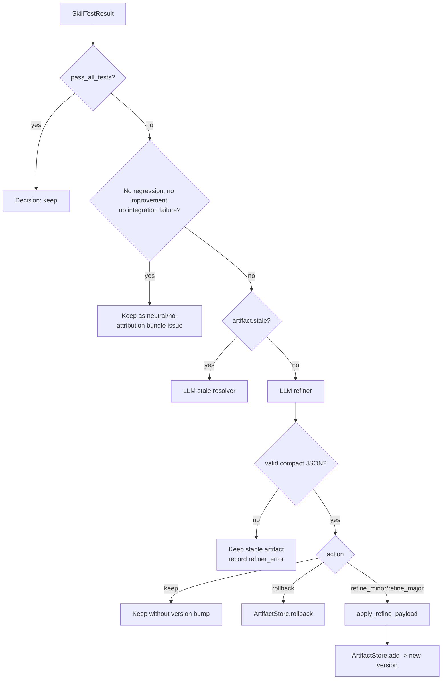

关键实现细节：

1. `action=keep` 不会发布新版本。早期实现曾误把 keep 当更新导致 version bump，已修复。
2. neutral failure 不触发 refiner。条件是 `n_regressed=0`、`n_improved=0`、没有 `integration_failures`。
3. refiner prompt 现在要求 patch-style 输出，避免复制完整 artifact/bundle 导致 JSON 截断。
4. refiner parse fail 不会终止实验，会返回 keep decision 和 `refiner_error`。
5. 真正 refine 后通过 `ArtifactStore.add()` 发布新版本，因此仍走 history/stale/bundle version 逻辑。

---

## 6. BFCL Evolve Orchestration

源码：`academic/benchmarks/run.py::_run_bfcl_evolve`

### 6.1 Full Control Flow

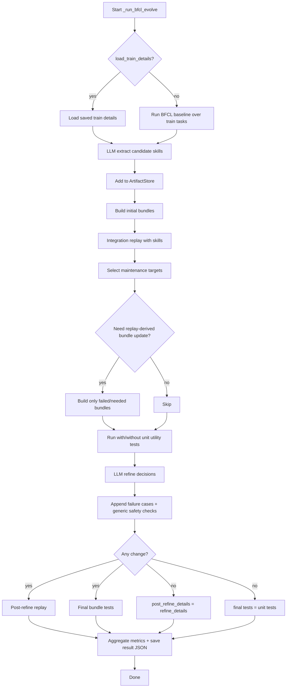

### 6.2 Phase Timing Logs

`_run_bfcl_evolve` 内部定义 `log_phase(...)`。每个阶段结束时打印：

```json
{"progress": "bfcl_evolve_phase_done", "phase": "train_rollout", "duration_s": 338.154}
```

这次 `local_claude_10_fast` 的关键耗时：

| Phase | Duration |
| --- | ---: |
| train rollout | 338.154s |
| extractor | 22.179s |
| initial bundle build | 8.007s |
| integration replay | 335.155s |
| replay bundle build | 4.846s |
| unit utility tests | 16.162s |
| refiner | 0s |

结论：10case 中主要瓶颈是 executor 真实多轮 BFCL replay，不是 local Claude proxy。

### 6.3 Replay Bundle Update Logic

二次 bundle builder 不再无条件跑。当前逻辑：

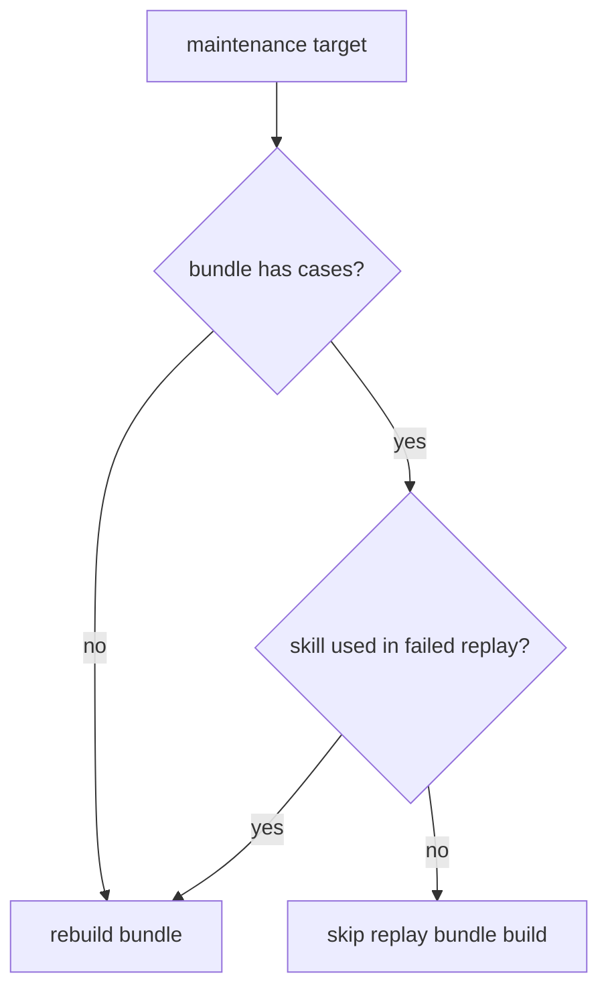

这避免 replay 已经 official valid 时还重复让 LLM 构造同一批 bundle。

---

## 7. BFCL Adapter Internals

### 7.1 Trace to Skill

`extract_bfcl_skill_artifacts_llm(...)` 将 BFCL result 转为 extractor 输入：

- `_tool_names_from_results()` 从 tool_calls 和 call_errors 提取 relevant tools。
- `_domains_from_results()` 从 task metadata / official check 提取 involved classes。
- `_intent_keywords_from_results()` 从 user question 提取粗略关键词。
- 通用 extractor 输出后，wrapper 给每个 artifact 补 `allowed_tools/domains/intent_keywords/source_task_ids`。

当前已知风险：如果一次 train set 混合多个 domain，而 extractor 输出了一个 file-system skill，wrapper 会把整批 relevant tools/source_task_ids 都加到该 skill 上。`local_claude_10_fast` 就暴露了这个问题：两个 filesystem skill 被注入到全部 10 个 replay tasks。这是 retrieval pollution，后续需要按 skill scope 做更细粒度 attribution，而不是整批 metadata enrichment。

### 7.2 Bundle Case to Runnable Task

源码：`bfcl_llm_maintenance.py::_task_from_case`

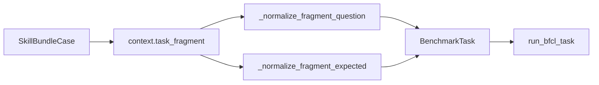

要求：

- `task_fragment.question` 是 turn array，每个 turn 是 message object array。
- `task_fragment.expected` 是按 turn 分组的 expected call strings。
- 如果 fragment 不完整，case 只能作为 `bundle_only` 记录，不跑真实 executor。

### 7.3 Unit Utility Test

`execute_bfcl_bundle_tests(...)` 对每个 runnable case 运行两遍：

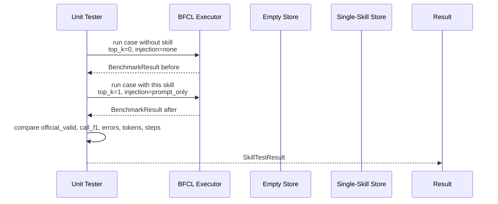

当前 pass/fail 策略：

- `with_skill` variant 的 `passed` 以 BFCL `official_valid` 为主。
- `call_errors` 仍记录为 diagnostic，但不直接让 official-valid case 失败。
- `improved_case`：official_valid 从非真到真，或 F1 提升，或 call_errors 减少。
- `regressed_case`：official_valid 从真到非真，或 F1 下降，或 call_errors 增加。
- `pass_all_tests = n_regressed == 0 and len(integration_failures) == 0`。

这是一版 pragmatic 策略。论文最终如果强调 token reduction，也应把 `delta_tokens <= 0` 加入 pass 标准或单独报告，而不是只作为 metric。

---

## 8. 结果文件和前端消费

### 8.1 Source-of-Truth Files

`_run_bfcl_evolve` 返回并保存的 `result.json` 包含：

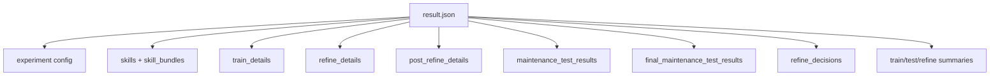

增量文件：

- `*_partial_train.json`：train rollout 中间结果。
- `*_partial_refine.json`：integration replay 中间结果。
- `*_skills.json`：保存后的 skill store。
- `*.audit.jsonl`：可选，只有设置 `SKILL_MAINTENANCE_AUDIT_LOG` 才有。

### 8.2 Web API

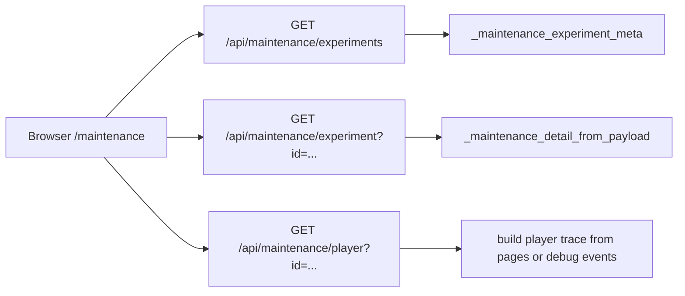

当前 discovery 规则：

- 扫描 `academic/results/bfcl_real_glm_maintenance_*`。
- 子目录中优先选择 `result.json`，再选择 `*_evolve.json`。
- 如果目录里同时有 `partial_train.json/partial_refine.json/skills.json`，不会再误选 partial 文件。

`local_claude_10_fast` 的前端路径：

- URL：`/maintenance`
- experiment id：`bfcl_real_glm_maintenance_2026-05-11__10_local_claude_10_fast`
- result path：`academic/results/bfcl_real_glm_maintenance_2026-05-11/10_local_claude_10_fast/result.json`

### 8.3 Role Audit Caveat

本次 10case run 没有设置 `SKILL_MAINTENANCE_AUDIT_LOG`，因此没有 extractor/bundle/refiner 的 raw system/user/raw_response JSONL。前端仍可展示：

- executor traces/debug events；
- generated skills；
- bundles；
- maintenance test results；
- refine decisions；
- aggregate metrics。

但 role I/O dropdown 中 audit rows 为 0。若要完整审计 role 输入输出，运行时必须设置：

```bash
SKILL_MAINTENANCE_AUDIT_LOG=academic/results/.../roles.audit.jsonl \
python /tmp/run_local_claude_bfcl.py ...
```

---

## 9. Failure and Recovery Paths

### 9.1 Bundle Builder Failure

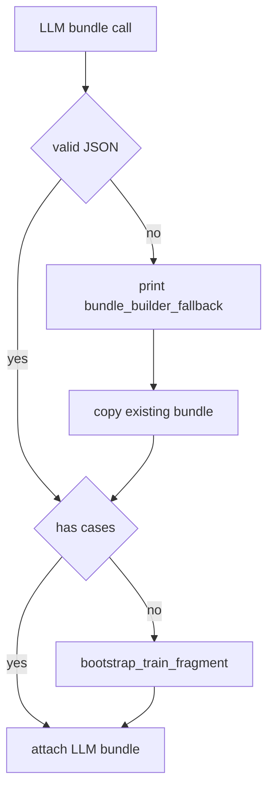

这保证 bundle builder 失败不会终止整次实验。但 fallback case 可能过粗，所以正式实验应检查 `bundle_builder_fallback` 日志。

### 9.2 Refiner Failure

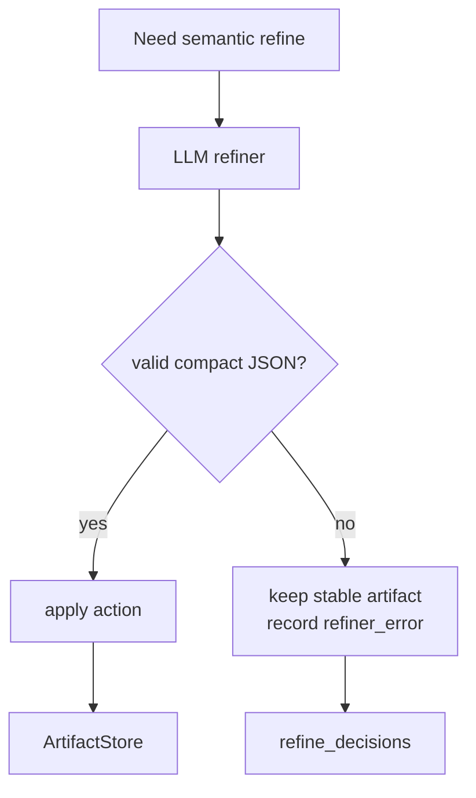

这次修复前，Claude refiner 曾输出 15k chars 并被截断，导致实验崩溃。现在 prompt 要求 compact patch，且 parse failure 降级为 keep。

### 9.3 No-Change Fast Path

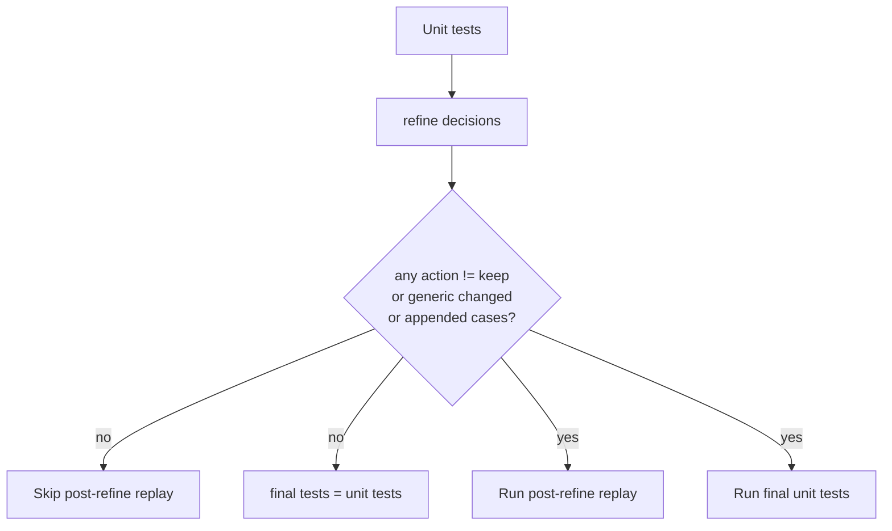

这避免“没有改动也重复跑一遍 final unit tests”。

---

## 10. Current Known Limitations

这些不是隐藏 bug，而是当前第一版需要继续迭代的明确边界。

### 10.1 Retrieval Pollution

`local_claude_10_fast` 中 extractor 从 10 个混合 train traces 抽出了 filesystem skills，但 replay 中这两个 skills 被注入到全部 10 个 tasks。原因包括：

- metadata enrichment 使用整批 `relevant_tools/source_task_ids`，scope 太粗。
- retriever predicate/rerank 仍不足以隔离 domain。
- prompt injection top_k 对低相关任务仍可能选择非零 score 的 skill。

建议修复：

- extractor 输出 per-skill evidence scope。
- BFCL wrapper 只把与该 skill evidence 相关的 tools/task_ids 写入 metadata。
- retriever 加 hard domain/tool compatibility filter。
- 对 selected skills 记录更详细 per-candidate score，用 UI 专门检查污染。

### 10.2 Bundle Coverage Is Capped

当前 bundle builder 最多每类 1 case，unit tester 实际只跑第一个 case。这是为了让真实 LLM smoke 可跑。最终论文实验需要打开更多 cases，并报告成本。

### 10.3 Token Reduction Not Yet A Hard Pass Criterion

当前 unit utility report 记录 `delta_tokens` 和 `delta_steps`，但 `pass_all_tests` 主要由 correctness/regression 决定。若论文定义“skill work = acc 不降且 token 下降”，需要把 token criterion 加到 pass 标准或作为独立筛选。

### 10.4 Audit Log Is Optional

LLM role raw I/O 只有设置 `SKILL_MAINTENANCE_AUDIT_LOG` 才写入。正式可复现实验应强制设置，不应依赖 stdout。

### 10.5 State Machine Algorithm Is Not Yet The Sole Controller

`maintenance_state_machine.py` 已用于 UI player，但核心算法主控仍是 `_run_bfcl_evolve` 的 procedural pipeline。之前讨论的 event/state/slot-driven backend 还没有完全替代 runner。

---

## 11. How To Debug A Run

### 11.1 快速定位慢在哪

看 stdout 中的：

- `bfcl_task_run`：单个 BFCL executor task 耗时。
- `maintenance_llm_start/done`：每个 LLM role 耗时和输出字符数。
- `bfcl_evolve_phase_done`：pipeline phase 耗时。

若 `maintenance_llm_done.response_chars` 很大，说明 role prompt/schema 可能让模型复制了太多 JSON。

### 11.2 检查 skill 是否真的有用

在 result JSON 中看：

- `train_summary.official_valid_rate`
- `refine_summary_before.official_valid_rate`
- `maintenance_test_results[*].aggregate.unit_utility_report`
- `refine_skill_impact[*].helped_official_task_ids`
- `failed_after_injection_task_ids`

### 11.3 检查 bundle 是否轻量

看：

- `skill_bundles[skill].positive_cases`
- `negative_cases`
- `integration_cases`
- 每个 case 的 `context.task_fragment.question/expected`

如果 case 复制了完整 trace 或多 turn 无关内容，就是 bundle builder prompt 或 post-processing 的问题。

### 11.4 检查检索污染

看 executor metrics：

- `retrieved_skills`
- `prompt_injected_skills`
- trace debug events 中 retrieval audit candidates。

若一个 domain-specific skill 在所有 task 都被注入，应检查 metadata scope 和 retriever predicate。

---

## 12. Repro Commands

### 12.1 Fast 10case Claude run

```bash
BFCL_MAX_EXTRACTED_SKILLS=3 \
BFCL_MAX_MAINTENANCE_TARGETS=3 \
BFCL_MAINTENANCE_CONCURRENCY=2 \
BFCL_UNIT_TEST_CONCURRENCY=2 \
python /tmp/run_local_claude_bfcl.py \
  --benchmark bfcl_v3 --mode evolve \
  --llm-config local_claude_proxy --model-name claude-sonnet-4-5 \
  --n-train 10 --n-test 0 --n-train-runs 1 --n-runs 1 \
  --tag local_claude_10_fast \
  --bfcl-tool-api-style anthropic_direct \
  --bfcl-prompt-style native --bfcl-adapter-mode official \
  --bfcl-execution-backend official \
  --top-k-skills 2 --skill-injection-mode prompt_only \
  --max-steps-per-turn 8 --max-task-seconds 120 \
  --partial-output academic/results/bfcl_v3_local_claude_10_fast_partial.json \
  --output academic/results/bfcl_v3_local_claude_10_fast_evolve.json \
  --save-skills academic/results/bfcl_v3_local_claude_10_fast_skills.json
```

### 12.2 Same run with role audit

```bash
SKILL_MAINTENANCE_AUDIT_LOG=academic/results/bfcl_real_glm_maintenance_2026-05-11/10_local_claude_10_fast/roles.audit.jsonl \
BFCL_MAX_EXTRACTED_SKILLS=3 \
BFCL_MAX_MAINTENANCE_TARGETS=3 \
BFCL_MAINTENANCE_CONCURRENCY=2 \
BFCL_UNIT_TEST_CONCURRENCY=2 \
python /tmp/run_local_claude_bfcl.py ...
```

### 12.3 Verification

```bash
python -m py_compile \
  academic/skill_repository/*.py \
  academic/benchmarks/bfcl_llm_maintenance.py \
  academic/benchmarks/run.py \
  academic/webapp/app.py

python scripts/maintenance_player_mock_integration.py
```

---

## 13. Mental Model For Reviewing Bugs

把系统想象成一个编译器和测试框架：

```mermaid
flowchart LR
    Trace[Trace evidence] --> Extract[Compile to skill source]
    Extract --> Bundle[Compile to tests]
    Bundle --> Unit[Run unit tests]
    Unit --> Refine[Patch source/tests]
    Refine --> Store[Publish version]
    Store --> Runtime[Use in next execution]
```

排查 bug 时不要只看最终 accuracy。按顺序问：

1. Trace 是否真实、完整？
2. Extractor 是否从正确证据抽出正确 scope 的 skill？
3. Store 是否保留了旧 bundle/evidence/history？
4. Retriever 是否把 skill 注入到了合理 task？
5. Bundle case 是否只测这个 skill 的作用域？
6. Unit test 的 with/without 是否公平？
7. Refiner 是否只在真正 regression 时修改？
8. 新版本是否通过 tests 后才被发布？
9. Result JSON 是否保存了足够证据让 UI 复现？

这个顺序也是当前后端实现的审查顺序。

---

## 14. Frontend Monitoring Contract

前端的主职责不是展示内部状态机事件，而是监控论文方法的核心算法产物。当前 `/maintenance` 默认进入 `Algorithm Monitor` 页，展示顺序固定为：

```mermaid
flowchart LR
    Exec[Executor<br/>train traces] --> Ext[Extractor<br/>skills]
    Ext --> Bundle[Bundle Builder<br/>unit cases]
    Bundle --> Replay[Integration Replay<br/>with skills]
    Replay --> Unit[Unit Utility Test<br/>with/without]
    Unit --> Refine[Refiner<br/>keep/modify/disable]
    Refine --> Store[Skill Store<br/>final repo]
```

每张主卡片只显示三类高优先级信息：

| 区域 | 内容 | 不展示什么 |
|---|---|---|
| Header | role 名称、动作名称、简短 subtitle | 内部 event id、frame delta |
| Metrics | 最关键的 2-4 个指标，例如 official valid、平均 token、bundle case 数 | 大量 debug counters |
| Input/Output 摘要 | 一句话解释该 role 消费了什么、产出了什么 | 原始 JSON 全量展开 |

完整信息通过弹窗查看：

| 弹窗 | 用途 |
|---|---|
| `Input` | 当前 role 的算法输入，例如 task 摘要、skill store 摘要、unit report 摘要 |
| `Output` | 当前 role 的真实算法输出，例如 skill 文本、bundle case、test result、refine decision |
| `Debug Raw` | 原始 payload 或从 result JSON 复原的底层字段，只用于排错 |

如果一次实验没有设置 `SKILL_MAINTENANCE_AUDIT_LOG`，前端必须显式提示：extractor、bundle builder、refiner 的原始 prompt/raw response 不可用。此时页面仍然展示 `result.json` 中真实保存的算法产物，但不能伪装成完整 role audit。

前端 API 约定在 `academic/webapp/app.py` 中完成：

| Helper | 输出 |
|---|---|
| `_algorithm_monitor_cards` | 从 generic evolve result 构建 Algorithm 页卡片 |
| `_algorithm_card` | 统一 role card schema，包括 `input_summary`、`output_summary`、`detail.input`、`detail.output`、`detail.debug_raw` |
| `_skill_algorithm_preview` | skill explorer 风格的 skill 摘要：name、description、body、interface、bundle counts、keywords、dependencies |
| `_bundle_algorithm_preview` | bundle 的正例/反例/integration case 预览和 with/without protocol |
| `_maintenance_test_card` | unit utility report，包含 aggregate、counterfactual、per-case run |

前端渲染约定在 `academic/webapp/static/maintenance.js` 中完成：

| Renderer | 职责 |
|---|---|
| `renderExperimentOverviewView` | 默认显示 Algorithm Monitor，不再默认展示 player/event UI |
| `normalizeAlgorithmMonitorCard` | 把后端 algorithm card 转成顺序 role card |
| `renderSequentialCard` | 只展示核心输入/输出摘要和少量指标 |
| `openSequentialPayloadModal` | 打开 Input / Output / Debug Raw 的 JSON tree |

这个边界很重要：状态机事件、播放器 frame、debug delta 仍可作为底层基础设施存在，但默认 UI 不把它们作为用户主要阅读对象。用户首先看到的是算法每一步的输入、输出和产物。
