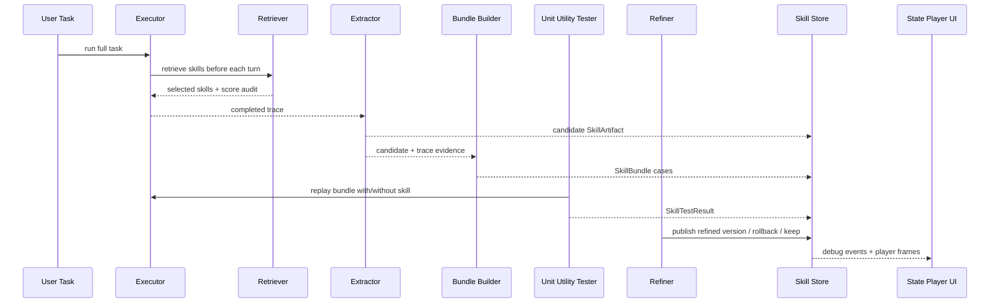

# Skill Repository Maintenance

这个目录是 skill repository maintenance 的通用核心层。它的目标不是为某个 benchmark 写一组规则，而是维护一个可测试、可回滚、可演化、可可视化审计的 skill repository。

当前实现已经把算法抽象成两条一致的线：

- 运行时算法线：executor 完成一道题后，LLM roles 依次执行 extraction、bundle building、unit utility testing、refinement、store update。
- 可视化状态线：同一套过程被记录成状态机 frames，前端可以像播放器一样逐帧查看 role、skill store、trace、bundle、test result 的状态变化。

## 快速阅读顺序

建议按下面顺序读代码和文档：

1. [MAINTENANCE_ARCHITECTURE.md](MAINTENANCE_ARCHITECTURE.md)
2. [MAINTENANCE_API_REFERENCE.md](MAINTENANCE_API_REFERENCE.md)
3. [types.py](types.py)
4. [store.py](store.py)
5. [llm_maintenance.py](llm_maintenance.py)
6. [maintenance_state_machine.py](maintenance_state_machine.py)
7. [debug_events.py](debug_events.py)
8. [../benchmarks/bfcl.py](../benchmarks/bfcl.py)
9. [../benchmarks/bfcl_llm_maintenance.py](../benchmarks/bfcl_llm_maintenance.py)
10. [../webapp/app.py](../webapp/app.py)

## 核心设计



## 目录职责

| 文件 | 职责 |
| --- | --- |
| `types.py` | benchmark-agnostic dataclass schema。定义 skill、interface、bundle、test result、lineage、dependency pin。 |
| `store.py` | repository 状态管理。负责版本历史、bundle/test result 分离、依赖检测、stale 标记、rollback、基础检索和检索审计。 |
| `llm_maintenance.py` | LLM-driven maintenance roles。封装 extractor、bundle builder、refiner、stale resolver 的输入输出协议和 audit log。 |
| `maintenance_state_machine.py` | 状态机和播放器 frame 模型。把 debug events 或 legacy pages 转成 UI 可回放的状态序列。 |
| `debug_events.py` | 结构化事件日志。所有 executor、retriever、maintenance role 都通过它记录输入、输出、指标和 store 状态。 |
| `METHOD_VALIDATION_TEST_PLAN.md` | 方法级测试设计与 feature-to-case 对应关系。 |

## Benchmark 边界

`academic/skill_repository` 只放通用核心，不应该写入 BFCL 专用判断。

不应该放在这里的内容：

- BFCL task fragment 到真实 task 的还原规则。
- BFCL official verifier。
- BFCL tool schema 裁剪。
- BFCL turn-level retrieval predicate/rerank。
- 某个 benchmark 的 handcrafted rubric。

这些都属于 adapter 层，当前主要在：

- [../benchmarks/bfcl.py](../benchmarks/bfcl.py)
- [../benchmarks/bfcl_llm_maintenance.py](../benchmarks/bfcl_llm_maintenance.py)
- [../benchmarks/bfcl_real_maintenance_probe.py](../benchmarks/bfcl_real_maintenance_probe.py)

## 当前状态机思路

状态机的最小单位是 frame。每个 frame 表示一个 action 完成后系统状态的快照或 delta。

状态机元素包括：

- role：executor、retriever、extractor、bundle builder、unit tester、refiner。
- artifact：skill、bundle、test result、trace、retrieval audit。
- store：当前 skill repository summary 和 skill snapshots。

每一步只允许少数元素变化。这样 UI 可以高亮变化元素，也可以让人从上一帧推导下一帧。

当前实现兼容两种日志来源：

- 新日志：`debug_events`，优先转成 player frames。
- 旧日志：`pages/flow_cards`，作为 legacy adapter 转成 player frames。

长日志会自动使用 delta 编码，避免每帧复制完整状态导致前端加载过慢。

## 日志与播放器的新约定

实验原始 JSON 是审计事实源，播放器 API 是交互视图源。两者不能混用：

- 原始结果文件保留完整 trace、role input/output、skill/bundle/test result。
- `/api/maintenance/experiment` 返回面向卡片和详情页的结构化摘要。
- `/api/maintenance/player` 返回逐帧状态机数据，只携带可视化需要的 compact event，不在每帧重复完整 prompt、store、trace。

debug event 到 player frame 的转换会做专用压缩：

- `messages/user_messages/system/raw_response` 只保留可读片段。
- `retrieval.candidates/selected` 保留 name、rank、score、filter reason、selected 等调试字段。
- `store_after/skills` 在 player 中只保留导航摘要；完整 skill/bundle 从 experiment detail 的 artifact card 查看。
- `unit_case_runs` 在 player 中保留 pass/fail、tokens、steps、tool calls 摘要；完整 per-case I/O 由新实验日志提供。

历史实验如果没有记录 per-case `input_payload/expected_behavior/actual_output`，UI 会显示 `io_available=false` 和缺失原因，不会伪造 test 输出。重跑新实验后，当前 logger 会把这些字段写入 `SkillTestCaseRun`。

## 重跑真实实验

真实 GLM 探针入口：

```bash
python -m academic.benchmarks.bfcl_real_maintenance_probe --experiment exp2 --timeout-s 900
```

默认输出目录按日期生成：

- result：`academic/results/bfcl_real_glm_maintenance_YYYY-MM-DD/...`
- audit log：`academic/results/real_glm_maintenance_YYYY-MM-DD/full_logs/...`

如果需要固定日期，设置：

```bash
SKILL_MAINTENANCE_DATE=2026-05-11 python -m academic.benchmarks.bfcl_real_maintenance_probe --experiment exp2 --timeout-s 900
```

`exp2` 是当前推荐 smoke：覆盖手工 fault injection、bundle test、LLM refiner、post-repair verify，运行时间显著短于 exp3。

## Web UI

相关入口：

- `/maintenance`：真实实验浏览。
- `/method-tests`：方法级验证测试浏览。
- `/maintenance-docs`：独立文档浏览器，按章节渲染本目录 Markdown。

文档浏览器会调用：

- `/api/maintenance/docs`

实验播放器会调用：

- `/api/maintenance/experiments`
- `/api/maintenance/experiment?id=...`
- `/api/maintenance/player?id=...`

## 验证命令

```bash
python -m pytest academic/method_validation/tests -q
python -m py_compile academic/skill_repository/*.py academic/benchmarks/bfcl_llm_maintenance.py academic/webapp/app.py
node --check academic/webapp/static/maintenance.js
node --check academic/webapp/static/maintenance_docs.js
python scripts/maintenance_player_mock_integration.py
```

`scripts/maintenance_player_mock_integration.py` 是前后端 mock integration harness，参考 MetaAgent snapshot/refine 的联调方式实现。它不依赖人工打开浏览器，而是：

- 通过 Flask test client 调真实 `/api/maintenance/experiments`、`/api/maintenance/experiment`、`/api/maintenance/player`。
- 检查当前实验有可播放 frames，且 frame 带有 `consumed_slots/produced_slots`。
- 用 Node VM 加载 `academic/webapp/static/maintenance.js`，调用 `buildPlayerScene` 和 `renderPixelPlayerBoard`。
- 断言播放器使用 `factory-canvas`、`factory-wire-layer`、`slot-jack`、`slot-port`，并且不再渲染旧的 `factory-edge/diagonal-edge`。
- 断言 SVG path 是横竖正交线路，作为 player UI 连线结构的回归检查。
